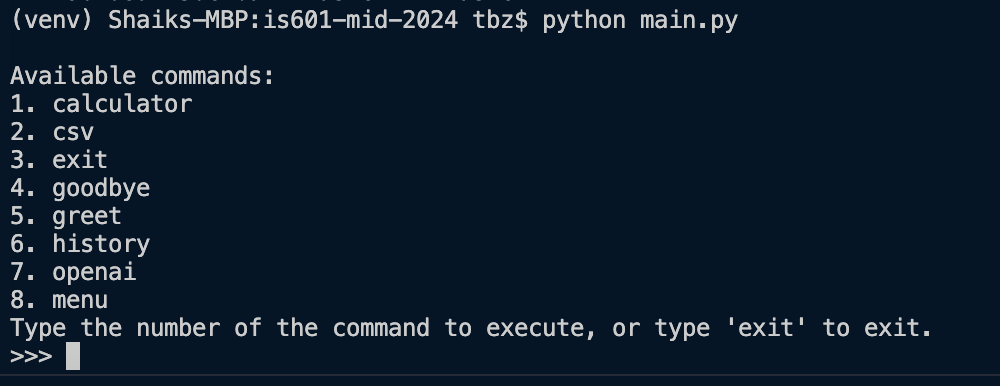
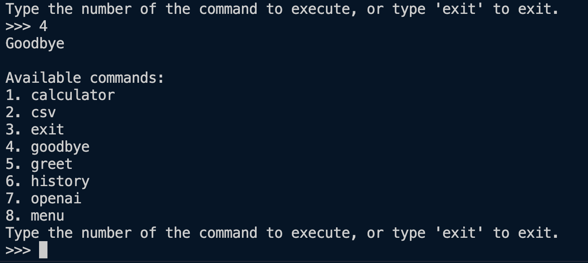

# All available commands and their functionalities with screenshots
Below is the screenshot when you run the app with `python main.py` command.

## 1. calculator:
Basic calculator option with menu driven navigation, here's an example of sum.

## 2. csv:
csv command uses pandas library and reads a csv file, and generates a new csv file with sorting the states by population. Below is sample usage:

## 3. exit:
Basic exit command to exit out application.

## 4. goodbye:
Prints out goodbye.

## 5. greet:
Print with a greeting message.

## 6. history:
All the commands that are entered are tracked into a history state, which can be accessed by this command. Same like calculator command even this is nested and 0 is used to navigate back. Here is the example of load and delete command from history command.

## 7. openai:
This is an extension command for integrating OPEN AI chat bot, with customized Agent. Professor has showcases Movie Agent, which will be integrated with LangChain. This is not part of the requirement and is completely independent, please exclude this from grading. However this is documented as part of project documentation. Hope this would not cause any confusion.

## 8. menu:
This is menu command, which basically prints out all the registered commands, to extend this further - this menu command also runs in itself, as in every option selected from the menu comman output works. Here is a sample of exit implemented from menu command.

