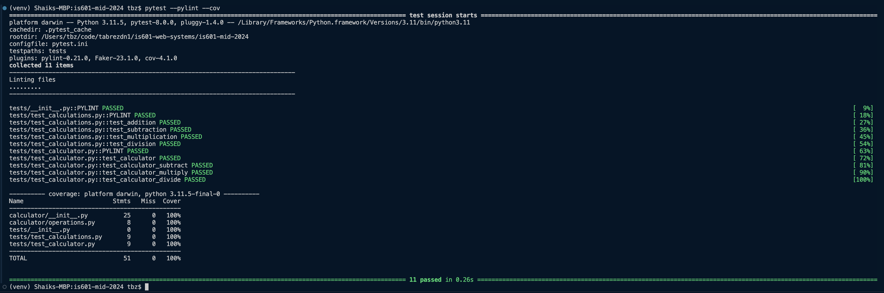

# Sample screenshot of project init setup


## Overview

In this phase, our goal is to establish a development setup for Python. Also making sure that I am able to run pytest, pylint, and coverage.

## Added features to project as part of this phase:
1. Set up a Python virtual environment and manage dependencies.
- **Python Virtual Environments**: Essential for managing project-specific dependencies.
2. Use `pip freeze` to create a `requirements.txt` file.
3. Configure and utilize pytest, pylint, and coverage in a Python project.
- **Pytest**: A powerful framework for writing and running Python tests.
- **Pylint**: A tool for analyzing your Python code for errors and enforcing a coding standard.
- **Coverage**: A tool for measuring the coverage of your unit tests.
4. Apply git commands for effective version control.
- **Git**: To practice version control techniques such as branching, merging, and using stash.

## How to run the tests:

```
pytest <-runs the tests without pylint or coverage
pytest --pylint <- Runs tests with pylint static code analysis
pytest --pylint --cov <-Runs tests, pylint, and coverage to check if you have all your code tested.

```