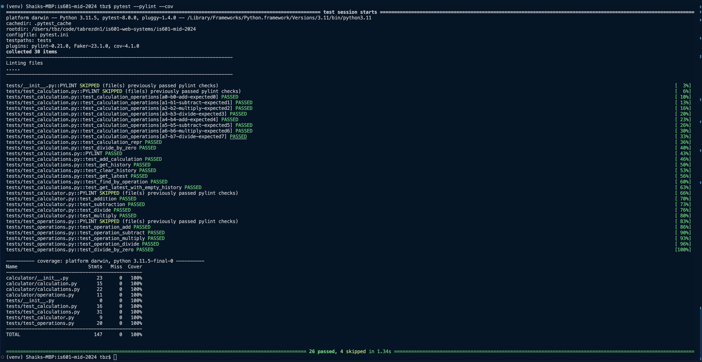

# Sample screenshot of project phase2 working setup

In this phase, I have added the basic principles of object-oriented programming, unit testing, and design principles such as **SOLID**, **DRY**, **GRASP**, and separation of concerns. Each functionality and classes are moved to a separate file for a better, modular, and clean code and functionality management.

## Added features to the project as part of this phase:
1. Static methods on the Calculator.
2. Instance methods on the Calculation.
- Having a calculation history to store calculation instances.
3. Class methods in the Calculations class.
4. Having the convenience methods in the calculations class to manage the history
5. More advanced testing that uses parameterized test data.
- Also introduction of fixture to make it easy to set up each test with consistent data.
6. There are also modifications to the .pylintrc file to control pylint's code analysis.
