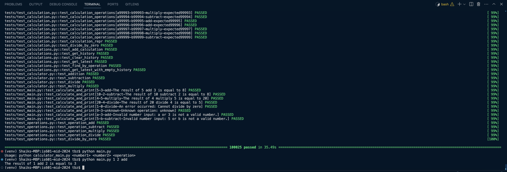

# Sample screenshot of project phase3 working setup

As in the above screenshot, I have showcased the usage of generating multiple test records(100,000+) and also the usage of the calculator app with input provided via terminal to main.py, which is serving as the entry point of the app.

## Added features to the project as part of this phase:
1. Use of Faker library for the generation of fake data.
- Add the faker library to the calculator app and update the requirements.txt and test cases accordingly.
2. Using of command line to generate N number of records dynamically for faker.
- Customize test cases with a dynamic number of records for testing by adding a new command line to Faker.
3. Introduction of main.py which serves as the main entry point of the app and also can be used in the terminal with custom user inputs.
- Usage via terminal for the given tests:
- a, b, operation, expected result
- "5", "3", 'add', "The result of 5 add 3 is equal to 8"
- "10", "2", 'subtract', "The result of 10 subtract 2 is equal to 8"
- "4", "5", 'multiply', "The result of 4 multiply 5 is equal to 20"
- "20", "4", 'divide', "The result of 20 divide 4 is equal to 5"
- "1", "0", 'divide', "An error occurred: Cannot divide by zero"
- "9", "3", 'unknown', "Unknown operation: unknown" # Test for unknown operation
- "a", "3", 'add', "Invalid number input: a or 3 is not a valid number." # Testing invalid number input
- "5", "b", 'subtract', "Invalid number input: 5 or b is not a valid number." # Testing another invalid number input