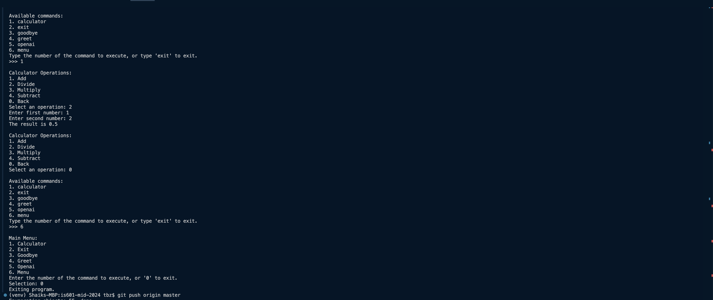

# Sample screenshot of project phase4 working setup

This phase is the most important and complex phase throughout the project. It focuses on the development of an interactive command-line application that operates continuously, transitioning from a single-execution script to a fully functional application. This includes transforming the calculator program into an interactive application using the design patterns as per the requirement and REPL (Read, Evaluate, Print, Loop) principles. This phase introduces some design patterns like command pattern and factory method, along with that a new way to dynamically load commands using a simple plugin architecture.

## Added features to project as part of this phase:
1. **Functionality :**
  - Implementation of command pattern and REPL.
  - Interactive calculator commands (add, subtract, multiply, divide).
  - Interactive openai command (chat.py)
  - Interactive menu commands.
  - Successful plugin architecture integration for dynamic command loading.
2. **Testing :**
  - Added test cases for three new commands: menu, calculator and openai.
  - Added test cases for dynamic plugin menu.
  - Added test cases for sub menu logic like for calculator and openai - which again has one more menu to navigate. NOTE: 0 is opted as menu command to go back.

## Testing Commands

- Run all tests with `pytest`.
- To test a specific file, use `pytest tests/test_main.py`.
- For linting and coverage, `pytest --pylint --cov` commands can be used separately.

