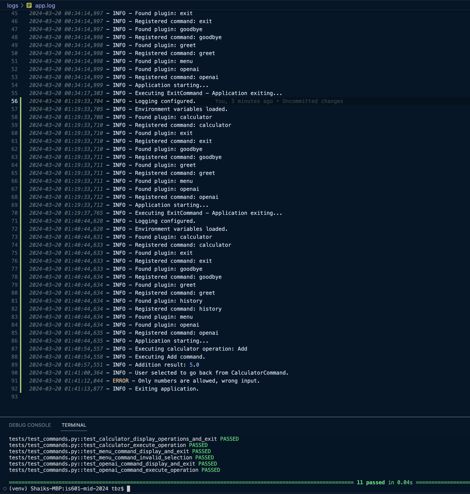

# Sample screenshot of project phase 5 working setup

This phase focuses on getting our app ready for production by adding features incorporating DevOps, Cloud Computing, Environment Variables, Logging, and Continuous Integration

## Added features to the project as part of this phase:
1. Add a GitHub action to the project.
- GitHub Actions to run your tests on GitHub automatically. It is currently set to trigger for two branches: DevOps and master. 
2. Add the .env file.
- Environment variables and their respective test cases for the app.
3. Add logging.
- Logging is how the program outputs information to external systems and is important for tracking application usage, security, and development, and also added logging-related test cases.

## Run the app
- `python main.py`

## Testing Commands

- Run all tests with `pytest`.
- To test a specific file, use `pytest tests/test_main.py`.
- For linting and coverage, `pytest --pylint --cov` commands can be used separately.

