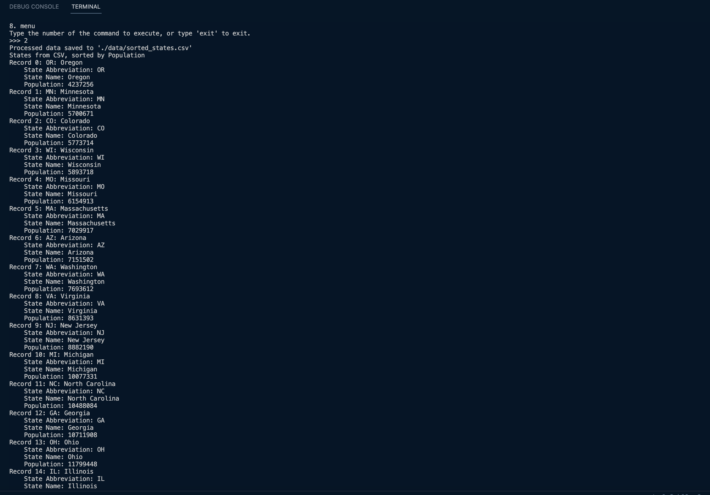

# Sample screenshot of project phase6 working setup

This phase focuses on adding data related operations and also implementing any further more design pattern concepts.

## Added features to project as part of this phase:
1. New command - history
- Every command is stored into history, and as this will only have one instance, therefore using Singleton Design Pattern is a right choice.
2. New command - csv
- Applying the concept of data structures and using pandas and numpy, CSV command basically reads a csv file and sorts the data and creates a new file and saves it. (Here in this case we have data of few US states and we sort this data based on population and generate a new file, the sorting is in ascending order).

## Run the app
- `python main.py`

## Testing Commands

- Run all tests with `pytest`.
- To test a specific file, use `pytest tests/test_main.py`.
- For linting and coverage, `pytest --pylint --cov` commands can be used separately.