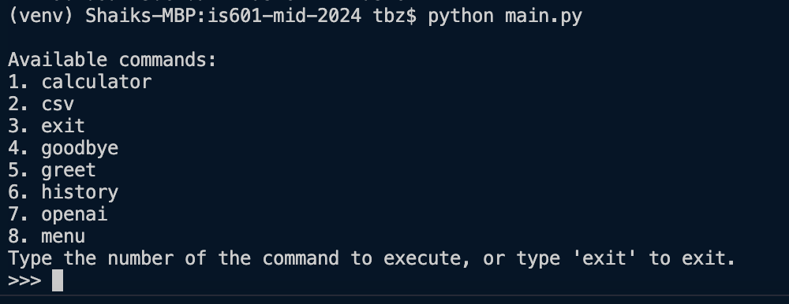
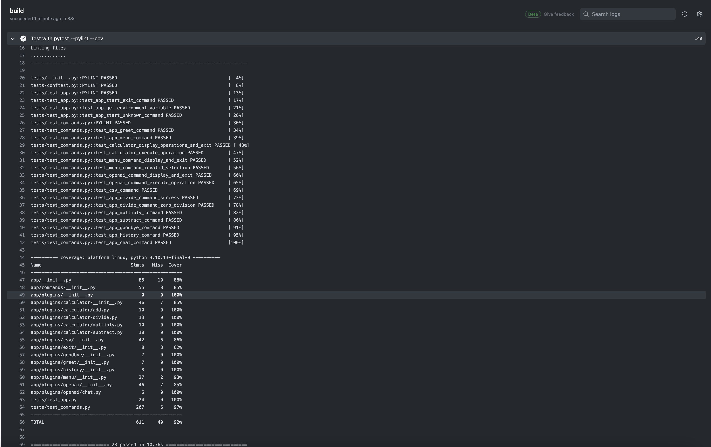

# Shaik Tabrez - Advanced Python Calculator

## Project Overview
This is an advanced Python-based calculator application. This application integrates clean, maintainable code, the application of design patterns, comprehensive logging, dynamic configuration via environment variables, sophisticated data handling with Pandas, and a command-line interface (REPL) for real-time user interaction.

## Demo video:

## Functionalities Implemented
### Running the app with `python main.py` command.

For detail description of all the commands showcased above: Please [View the document](docs/commands.md)

### Command-Line Interface (REPL)
Implemented a Read-Eval-Print Loop (REPL) to facilitate direct interaction with the calculator, history, and openAI command.
- Execution of arithmetic operations (Add, Subtract, Multiply, and Divide) is supported for the calculator.
- Management of calculation history (Load, Save, Clear, Delete) is supported on csv file.
- OpenAI plugin to integrate chat system with an AI agent. (BASE CODE completed, integrating AI agent still pending).
- Access to extended functionalities through dynamically loaded plugins is added.

### Plugin System
Created a flexible plugin system to allow seamless integration of new commands or features. This system allows:
- Dynamically load and integrate plugins without modifying the core application code.
- Include a REPL  "Menu" command to list all available plugin commands, ensuring user discoverability and interaction. 

### Calculation History Management with Pandas
Utilized Pandas to manage a robust calculation history, enabling users to:
- Load, save, clear, and delete history records through the REPL interface on a CSV file.

### Professional Logging Practices
Established a comprehensive logging system to record:
- Detailed application operations, data manipulations, errors, and informational messages.
- Differentiate log messages by severity (INFO, WARNING, ERROR) for effective monitoring.
- Dynamic logging configuration through environment variables for levels and output destinations.

### Advanced Data Handling with Pandas
Employ Pandas for:
- Efficient data reading and writing to CSV files.
- Managing calculation history.

### Design Patterns for Scalable Architecture
Incorporated key design patterns to address software design challenges. Below are the features and the incorporated design patterns implemented for them:
- **Command Pattern:** Structure commands within the REPL for effective calculation and history management.
- **Singleton Pattern:** The Singleton pattern ensures a class has only one instance and provides a global point of access to it. `CommandHistoryManager` class uses the Singleton pattern.
- **Factory Method:** Menu command uses this design pattern to accept `commandHandler` instance to load all the registered plugins as commands for the app.
- **Memento Pattern:** The functionality of `CommandHistoryManager` has a resemblance to the Memento pattern, which is used to capture and externalize an object's internal state so that the object can be restored to this state later.
- **Stratergy Patten:** CSV command could also have been implemented with Stratergy Pattern, but that would mean we have to manually register the command and add conditions check to plugin architecture.

Please [View the document](docs/design_patterns.md) for additional details on how each design pattern is implemented and what is the challenge that it covers.

## Development, Testing, and Documentation Completions
### Testing and Code Quality
- Achieved 90% test coverage with Pytest.
- Ensured the code quality and adherence to PEP 8 standards, verified by Pylint.
##### code coverage results from the build logs.

### Version Control Best Practices
- Utilize logical commits that group feature development and corresponding tests, evidencing clear development progression.

### Comprehensive Documentation
The entire development process is divided into phases and each phase has a discrete document to showcase the purpose and code changes and features added or removed as part of that phase.

- Phase 1: [View the document](docs/project_init.md)
- Phase 2: [View the document](docs/project_phase2.md)
- Phase 3: [View the document](docs/project_phase3.md)
- Phase 4: [View the document](docs/project_phase4.md)
- Phase 5: [View the document](docs/project_phase5.md)
- Phase 6: [View the document](docs/project_phase6.md)

# Conclusion of features and tasks added:
#### Functionality
- **Calculator Operations**
- **History Management**
- **Configuration via Environment Variables**
- **REPL Interface**

#### Design Patterns
- **Implementation and Application**
- **Documentation and Explanation**

#### Testing and Code Quality
- **Comprehensive Testing with Pytest**
- **Code Quality and Adherence to Standards**

#### Version Control, Documentation, and Logging
- **Commit History**
- **README Documentation**
- **Logging Practices**
